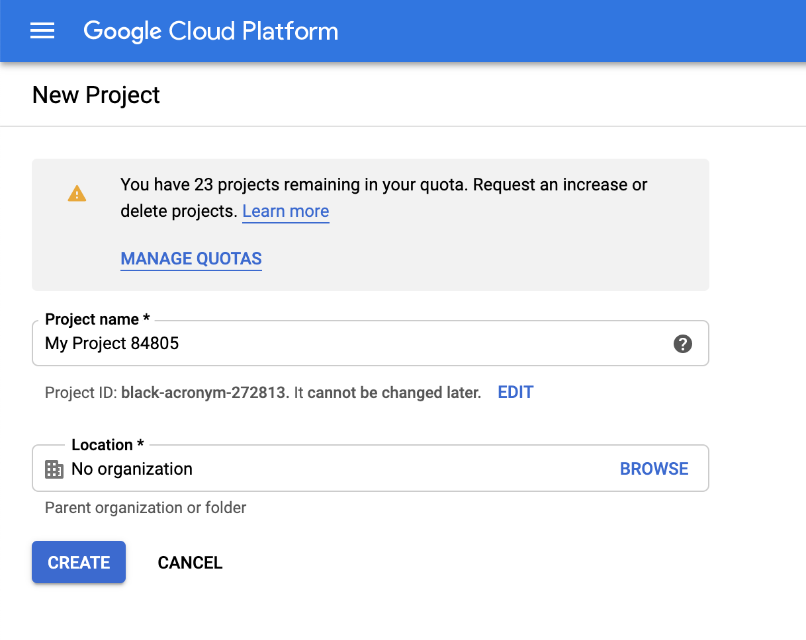

# GCP Bucket Creation using Terraform
Terraform code that creates and maintains infrastructure for stores, using  Google Cloud Storage which is an object storage service provided by Google Cloud Platform (GCP) in multiple geographical regions.

# Table of Contents
1. [Requirements](#requirements)
2. [Guides](#guides)
3. [GCcloud Login][#gcloud-login]
4. [State File](#state-file)
5. [Sensitive Data in State File](#densitive-data-in-ftate-file)
6. [Terraform Backends](#terraform-backends)


# Guides
1. [How to Deploy Infrastructure](Create_Infrastructure.md)
2. [How to Get Values from output](Get_Outputs.md)
3. [How to Update Infrastructure](Update_Infrastructure.md)
4. [How to Import Existing Infrastructure](Import_Infrastructure.md)
5. [How to Destroy Infrastructure](Destroy_Infrastructure.md)


# Requirements
* The [Terraform CLI][terraform-install] (1.2.0+) installed.
* The [GCloud CLI][gcp-cli-install] installed.
* [Terraform Basics][terraform-build-infrastructure]
* If you have an account with Google Cloud, log-in to your account and either create a project for Telestream Cloud (go to https://console.cloud.google.com/projectcreate) or pick one of your existing projects.


[gcp-cli-install]:https://cloud.google.com/sdk/docs/install
[terraform-install]:https://developer.hashicorp.com/terraform/tutorials/gcp-get-started/install-cli
[terraform-build-infrastructure]:https://developer.hashicorp.com/terraform/tutorials/gcp-get-started/google-cloud-platform-build
[state]:https://developer.hashicorp.com/terraform/language/state
[state-purpose]:https://developer.hashicorp.com/terraform/language/state/purpose
[sensitive-data]:https://developer.hashicorp.com/terraform/language/state/sensitive-data
[gcp-backend]:https://developer.hashicorp.com/terraform/language/settings/backends/gcs
[backend]:https://developer.hashicorp.com/terraform/language/settings/backends/configuration

# Gcloud Login
```sh
gcloud auth application-default login
```
Example:
```sh
$ gcloud auth application-default login
Your browser has been opened to visit:

    https://accounts.google.com/o/oauth2/auth?response_type=code&client_id=764086051850-asdhfasdhbfkjlasdnfasf.apps.googleusercontent.com&redirect_uri=http%3A%2F%2Flocalhost%3A8085%2F&scope=openid+https%3A%2F%2Fwww.googleapis.com%2Fauth%2Fuserinfo.email+https%3A%2F%2Fwww.googleapis.com%2Fauth%2Fcloud-platform+https%3A%2F%2Fwww.googleapis.com%2Fauth%2Fsqlservice.login+https%3A%2F%2Fwww.googleapis.com%2Fauth%2Faccounts.reauth&state=asdfasdfasdfasdfasdfsadfsdafsafasfasfa&access_type=offline&code_challenge=asdfasdfasfawefawfasdfasdf&code_challenge_method=S256


Credentials saved to file: [/Users/username/.config/gcloud/application_default_credentials.json]

These credentials will be used by any library that requests Application Default Credentials (ADC).

Quota project "gcp-project-123" was added to ADC which can be used by Google client libraries for billing and quota. Note that some services may still bill the project owning the resource.


Updates are available for some Google Cloud CLI components.  To install them,
please run:
  $ gcloud components update


To take a quick anonymous survey, run:
  $ gcloud survey

$ 
```
Use the credentials file in module to allow terraform access to project
```json
provider "google" {
    credentials = file("/path/to/credentials/file.json")
}
```
Example:
```json
provider "google" {
    credentials = file("/Users/username/.config/gcloud/application_default_credentials.json")
}
```
# Get Project id
To list projects that your account has access to
```sh
gcloud projects list
```
Example:
```sh
$ gcloud projects list
PROJECT_ID             NAME                  PROJECT_NUMBER
gcp-project-123        tcloud                1234567891012
lab-and-dev            lab-and-dev           2101987654321
$ 
```
Use the project_id that you want to deploy into and use that value for the project feild
```json
module "bucket" {
    source          = "../../Bucket"
    bucket_names    = ["<replace_with_unique_name_of_bucket>"]
    bucket_location = "<replace_with_location_of_bucket>"
    project         = "<replace_with_project_id_deploying_into>"
    service_account = {
        account_id  = "<replace_with_service_account_id_name>"
    }
}
```
Example:
```json
module "bucket" {
    source          = "../../Bucket"
    bucket_names    = ["<replace_with_unique_name_of_bucket>"]
    bucket_location = "<replace_with_location_of_bucket>"
    project         = "gcp-project-123"
    service_account = {
        account_id  = "<replace_with_service_account_id_name>"
    }
}
```
# State File
When using Terraform it needs to keep track of the infrastructure it's creating. It does this by means of a [state][state] file. This file is just a simple JSON file (though its extension is .tfstate) that defines the infrastructure that has been created by Terraform and any proposed changes. By default, this file is stored on the local machine where terraform commands are run and should be checked into git or any other source code management system used. More of the purpose of the state file can be explained [here][state-purpose]

# Sensitive Data in State File
The state file can handle sensitive data, if creating google_service_account with access and secret key this will be stored in plain text in the state file. So recommend keeping state file [secure][sensitive-data]. 

# Terraform Backends
But because this is just a simple file, it can actually be edited by anyone that has access to it and this might cause unwanted behaviors in the state of your infrastructure. Also, this is not ideal for collaboration as git conflicts may arise if multiple developers are modifying their own local copy of the file. Terraform introduce multiple online storage locations for this file called [backends][backend], and [GCP][gcp-backend] can be used as a backend to safely store your state file

